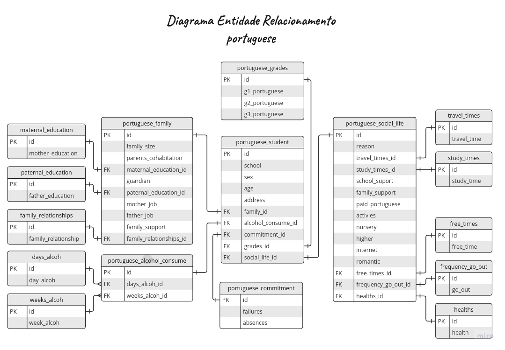
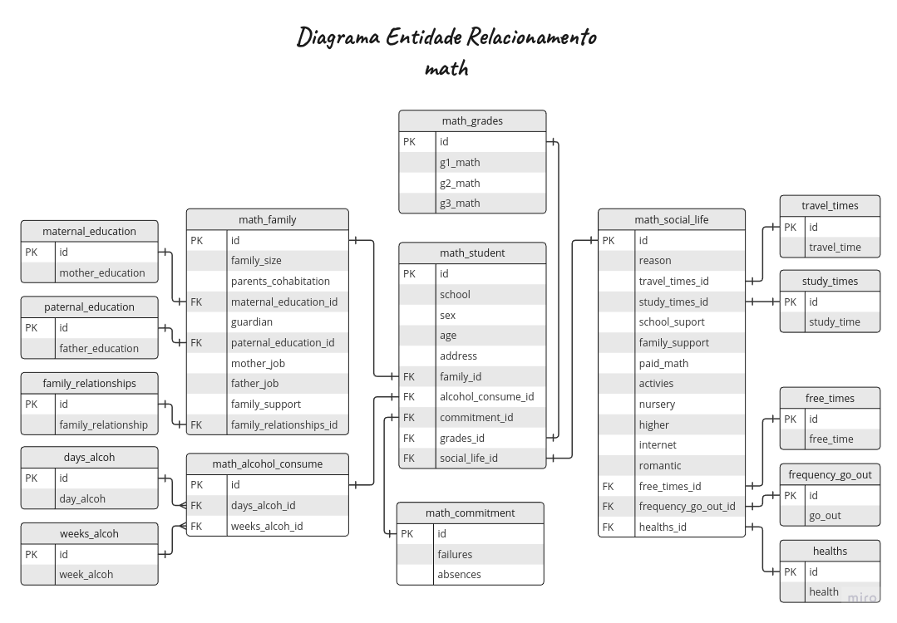

# Efeito do alcool no aprendizado - Data Analitcs

Os dados usados neste portfólio foram adquiridos no [kaggle](https://www.kaggle.com/datasets/08163f86754da93458b7dfb3e1c80258069edd817a00db655f3ccc3da37c87b5) e são baseados no estudo de [Cortez and Silva, 2008](https://repositorium.sdum.uminho.pt/bitstream/1822/8024/1/student.pdf) sobre este tema.

Os dados são constituidos por 2 datasets, coletados por meio de relatórios escolares e questionários, avaliam os alunos do ensino médio (*secondary education)* em duas materias distintas: lingua portuguesa (por) e matemática (mat). Em ambos os estudos são avaliados alunos das escolas: Gabriel Pereira (GP) e Mousinho da Silveira (MS). Eles são avaliados nos seguintes atributos: notas dos alunos, características demográficas, sociais e relacionadas à escola.

Alguns questionamentos podem conduzir essa exploração para compreender o grupo amostral destes alunos, como:

- Existe diferença de perfil entre os alunos que responderam o questionario de portugues e matemática (idade média, percentual de homens e mulheres, onde moram, o tempo de viagem casa-escola, tamanho da família)?
- O emprego do pai tem correlação com a nota media do filho?
- O nivel de educação do pai tem correlação com a nota media do filho?
- O emprego do mãe tem correlação com a nota media do filho?
- O nivel de educação do mãe tem correlação com a nota media do filho?
- O consumo de alcool semanal tem correlação com a qualidade do relacionamente do aluno com a familia?
- O consumo de alcool semanal influencia no desempenho escolar em ambas as disciplinas?
Qual a perda ou ganho desse desempenho?
- A idade é um fator que pode estar associado ao nivel de alcool consumido semanalmente? Tem alguma relação com a nota do aluno nas disciplinas? 
- Qual a taxa de estudantes que recorrem as aulas extra nas disciplinas? Existe alguma relação com o consumo de alcool ou será outro fator?
- Qual a faixa de idade dos estudantes que consomem niveis alcoolicos maiores em ambos os questionarios?
- O nivel de saídas dos estudantes influencia no nivel de consumo alcoolico?
- Niveis maiores de consumo de alcool afetam no tempo reservado pelo estudantes para o estudo? (ambas as disciplinas)
- É possivel verificar a tendem de algum genero para niveis de consumo alcolico maiores? (ambas as disciplinas)
- Qual o percentual dos estudantes que apresentam niveis critico para o consumo de alcool semanal apresentam extrema dependencia e precisam de ajuda imediada (ambas as disciplinas)?
- Existe alguma correlação entre o tempo livre do estudante e consumo alcoolico elevado na semana?
- Existe alguma correlação entre a frequencia de saídas do estudante e consumo alcoolico elevado na semana?
- Atividades extra classe evitam que o estudante consuma taxa menores de alcool semanalmente?
- Os relacionamentos amorosos influenciam no desempenho das disciplinas? Qual a perda ou ganho de desempenho dos estudantes que namoram? Existe domínio de um dos generos nesses grupos?
- O tempo de deslocamento casa x colégio pode influenciar no desempenho do estudante?
- O consumo de alcool pode aumentar a probabilidade do estudante repetir a disciplina? Se sim, qual a taxa de reprovações para niveis critico no consumo de alcool?
- O consumo de alcool pode na ocorrencia de falta escolares? Se sim, qual a taxa de falta para niveis critico no consumo de alcool?
- O consumo de alcool pode influenciar nas perspectivas acadêmicas do aluno?

A proposta deste portfólio é criar um dashboard viabilizado pela análise exploratória desses dados por meio do *Power BI*. Isso foi feito após limpeza e tratamento dos dados realizados tanto em *SQL* quanto em *Power Query*. O dashboard online está disponível para vizualização por meio deste [link](https://app.powerbi.com/view?r=eyJrIjoiNmRmZGZlMjEtZDY5OS00ZTZiLTljMDEtNmIwY2IyZTQwODljIiwidCI6ImFiMGE4YmE1LTMxMzctNGViYy05M2RkLTVmOGVjZDg1ODlhNCJ9).

## Datasets

Os datasets para lingua portuguesa e matemática apresentam originalmente com os seguintes campos descritos na [tabela com os campos dos questionários](./fields_reports_questionnaires.md). As notas de cada periodo para ambas as disciplinas estão presentes nos 2 datasets citados anteriormente e são descritos na [tabela para a nota de cada período](./fields_period_grade.md). 

## Diagrama de Entidade e Relacionamento (DER)

Os dados não atendem aos requisitos da segunda forma normal (NF2) por não conter o campo com as chaves primária, logo este campo foi criado nos datasets para promover a normalização. Assim, a figura apresenta o modelo lógico para os datasets que foram utilizados em Power BI para analizar os dados de cada disciplina.

### Portuguese students

### Math students

## Tratamento dos dados

Primeiramente, os datasets em **.txt** foram importados para um database MySql mais verossímil com um projeto em produção. Posteriormente, criamos as tabelas adicionais necessárias, a partir do SGBD, para deixar os dados mais legíveis na apresentação dos painéis em Power BI.

O [primeiro script](./create_aux_tables.sql) sql cria e gerir as tabelas necessárias para trazer transparência e clareza aos dados apresentados inicialmente de maneira numérica. A associação da classificação numérica para nominal (string) foi definida pela [tabela com os campos dos questionários](./fields_reports_questionnaires.md) nesse modelo fisico.

O [segundo script](./datasets_analytics.sql) sql é responsavel por gerar as tabelas organizadas conforme o [DER para os alunos de lingua portuguesa](./DER_portuguese.png) e o [DER para os alunos de matemática](./DER_math.png) especificados anteriormente. 

Alguns campos foram renomeados para melhor compreeensão. Essas alterarações são listadas na tabela a seguir:

|nomemclatura original | nomenclatura nova |
|------|-------|
| famsize | family_size |
| Pstatus | parents_cohabitation |
| Medu | maternal_education |
| Fedu | paternal_education |
| Mjob | mother_job |
| Fjob | father_job |
| schoolsup | school_support |
| famsup | family_support |
| famrel | family_relationship |
| Dalc | days_alcoh  |
| Walc | weeks_alcoh  |

O [terceiro script](./create_views.sql) sql gera as views necessárias para realizar o estudo exploratório sobre o efeito do alcool no desempenho escolar e extrair as informações contidas nestes questionários.

### Manipulações em Power Query
Criarmos via Power Query a coluna que corresponde a média das notas obtidas durante o ano para cada estudante. Isso foi aplicado para facilitar a visualização do desempenho dos estudantes em ambas as disciplinas.

A coluna da nota média (gavg_maths/gavg_portuguese) ao *adicionar coluna* que aplica a *função média* que pertence está localizada em *estatísticas*. Em seguida, aplicamos o *arredondamento* e escolhemos limitar a operação *arredondar* em 1 casa decimal.

Uma estratégia interessante foi criar novos grupos para alguns campos, por exemplo: study_time, go_out, free_time, family_relationship, days_alcoh, weeks_alcoh. Nesses campos algumas categorias foram aglutinadas para melhor compreensão e/ou legibilidade dos dados gráficos. Os processos realizados na criação desses novos grupos são explicitados a seguir:

#### study time frequency

| categorias originais | novas categorias |
|-----------|---------|
| <li> <2 hours | <li> bad |
| <li> 2 to 5 hours | <li> lower |
| <li> 5 to 10 hours | <li> normal |
| <li> >10 hours | <li> strong |

#### free time frequency

| categorias originais | novas categorias |
|-----------|---------|
| 
 <li> very low   <li> low 
 | <li> low |
| <li> moderate | <li> moderate |
| 
 <li> very high   <li> high 
 | <li> high |

#### go out frequency

| categorias originais | novas categorias |
|-----------|---------|
| 
 <li> very low   <li> low 
 | <li> low |
| <li> moderate | <li> moderate |
| 
 <li> very high   <li> high 
 | <li> high |

#### family relationship

| categorias originais | novas categorias |
|-----------|---------|
| 
 <li> very bad   <li> bad 
 | <li> bad |
| <li> neutro | <li> neutro |
| 
 <li> excellent   <li> good 
 | <li> good |

#### weekly_alcohol_frequency

| categorias originais | novas categorias |
|-----------|---------|
| 
 <li> very low   <li> low 
 | <li> social |
| <li> moderate | <li> moderate |
| 
 <li> very high   <li> high 
 | <li> critical |

#### daily_alcohol_frequency
  
| categorias originais | novas categorias |
|-----------|---------|
| 
 <li> very low   <li> low 
 | <li> social |
| <li> moderate | <li> moderate |
| 
 <li> very high   <li> high 
 | <li> critical |

## Painel Power BI

Os paíneis gerados em Power BI explora as características de cada escola, o perfil dos alunos, desempenho escolar, vida social e como o consumo de alcool pode influenciar esses fatores. Assim, os paínes apresentam as informações extraídas dos datasets nas seguintes divisões:

- Profile Portuguese
- Profile Math
- Family
- Alcohol & Performance
- Alcohol & Costumers
- Social Life
- Commitment

### Portuguese Profile
Apresenta aspectos gerais do grupo amostral de alunos retratado no formulario para a disciplina de lingua portuguesa. As seguintes perspectivas são exploradas: faixa etária dos alunos, proporção de alunos por sexo, razões para escolha da escola, região de moradia e tempo de viagem.

### Math Profile
Abordagem semenhante ao painel anterior, entretanto o grupo amostral para esta disciplina é menor e consequentemente diferente.

### Family
Explora a relação da influencia parental com o desempenho escolar dos alunos. E verifica se isso pode influenciar no consumo de álcool dos estudantes.

### Alcohol & Performance
Verifica se o consumo de alcool influencia na atuação escolar e se os diferentes níveis de consumo atenuam ou potencializar esse rendimento.

### Alcohol & Costumers
Busca identificar alguns atributos característicos que identifiquem os grupos de alunos que consomem álcool nos seus mais variados níveis.

### Social Life
Explora o vínculo de hábitos extra-classe com o consumo de álcool e a vida destes estudantes.

### Commitment
Explora como o consumo de álcool pode influenciar comportamento escolar.

## Análise exploratória

As informações extraídas, via dados fornecidos pelos questionários, demonstram como alguns aspectos específicos na vida desses estudantes podem afetar o seu desempenho escolar e suas perspectivas acadêmicas.

### Portuguese & Math Profile
As informações provenientes dos questionários apresenta que os estudantes de ambas disciplinas residem majoritariamente em áreas urbanas. Eles também expressaram os fatores que induziram escolher onde estudar e o resultado foi semelhante para as duas disciplinas. Enquanto a qualidade das aulas e a distância de casa foram as razões que influenciam os estudantes urbanos, as principais razões dos estudantes rurais são: a qualidade das aulas e a reputação da colégio. Quanto a faixa etária, a maior parte dos alunos tem idades entre 15 e 18 anos. Além disso, estudantes do sexo feminino são a maioria em ambos questionários e ambos os colégios. E a maior parte dos alunos moram próximos (< 15 min) dos colégios pesquisados, ~55% e 65% dos estudantes de língua portuguesa e matemática respectivamente.

### Family
A exploração do viés parental no desempenho dos estudantes apresentou que o grupo de alunos cujos pais e mães trabalham como professores ou área da saúde apresentam as maiores medias para ambas disciplinas, mesmo que estes alunos representem os menores percentuais dos estudantes. Outro aspecto observado é a escolaridade dos pais, onde os alunos cujo ambos os pais cursaram o ensino superior ou declararam nenhum nível de estudo são os que apresentam as maiores médias em matemática. Por outro lado, as maiores médias em português são apresentadas pelos grupos de estudandes cujo os pais cursaram ensino supeior ou ensino médio. 

Averiguar como a relação familiar pode influenciar no nível de alcool consumido pelos estudantes é outra abordagem possível neste tema. Verificamos em ambas as disciplinas que estudantes com relacionamento razoável ou ruim tendem a consumir níveis maiores de alcool, o contrário ocorre para os estudantes com bom relacionamento familiar.

### Alcohol & Performance
Aqui exploramos a existência de correlação entre o desempenho dos estudantes e os níveis de consumo de alcool. Verificamos que alunos com maiores consumos semanais apresentam queda no desempenho escolar, ou seja, a frequência do consumo semanal de alcool é inversamente proporcional as notas médias obtidas por esses estudantes. 

Os estudantes de lingua portuguesa que praticam consumo critico apresentam médias ~11% menores quando comparados com os que praticam consumo leve, e em casos mais extremos essa queda podes ser de ~13%. Em lingua portuguesa, a queda do desempenho médio é gradual corforme o consumo de alco aumenta. Em matemática a queda de desempemho entre os extremos é semelhante, desempenho ~9% menor, e em casos mais extremos essa queda podes ser de ~11%. Entretanto, a queda de desempenho não é gradual conforme foi observado em português. Isso pode ser visto tanto nos gráficos de consumo semanal como no gráfico de consumo diário.

Esse comportamento diferenciado para os alunos de matemática pode ser compreendido quando observamos o gráfico de aulas de reforço. Os estudantes de lingua portuguesa apresentam buscas inferiores a 10% para aulas de reforço, enquanto que para disciplina de matematica essa busca é superior a 40% em todos os grupos de consumo. Assim podemos extrair que os alunos sentem maior dificuldade para compreender a disciplina de matemática e buscam aulas de reforço para superar esta dificuldade. Logo, as médias dos estudantes de matemática são influenciadas tanto pelos níveis de consumo de alcool quanto pela dificuldade de aprendizagem desta disciplina.

Além dessas explorações, verificamos a influencia das idades nessa correlação. Nos estudantes de lingua portuguesa verificamos que a idade média dos alunos apresenta correlaçao positiva com o consumo crescente de alcool, ou seja, alunos que consomem níveis mais críticos de alcool apresentam as maiores idades médias. Entretanto em matemática isso não é uma verdade, pois os estudantes que consomem alcool com alta frequencia apresentam idade média menor do que os estudantes que consomem pouco alcool ou de maneira moderada. A maior dificuldade de aprendizagem para disciplina de matématica também pode influenciar nessa avalição e explicar a falta de correlação entre as idades e o rendimento médio nessa disciplina.

### Alcohol & Constumers

Explorando o perfil dos consumidores de alcool nos estudates verificamos algumas tendências nas áreas: idades, gênero, vida social e escolar.

Inicialmente verificamos a idade de um provavel estudante que pratica consumo crítico semanal de alcool. A idade de um estudante com este perfil está entre 16 e 18 anos, onde mais de 75% destes estundantes estão localizados nesta faixa etária.

Outro aspecto explorado foi verificar se a frequencia de saídas/passeios que os estudantes praticam apresenta alguma correlação com o consumo semanal de alcool. Os grupos amostrais das duas disciplinas apresentaram perfis muito semelhantes, onde o aumento de saídas está diretamente ligado com o maior consumo de alcool e vice-versa. O percentual de alunos de lingua portuguesa com consumo critico e saem com alta frequencia é ~73%, um percentual 2,5 vezes maior quando comparado com os que consomem pouco. Quando avaliamos o grupo amostral de matemática esse aumento é de ~3,5 vezes.

O genero dos estudantes também foi verificado para traçar o perfil alcoolico. Explorando os dados é possível constatar que o publico masculino tende a aumentar conforme aumenta a frequencia no consumo semanal de alcool, nas duas disciplinas. Entretanto, nos grupos de consumo critico o publico masculino é predominante e representam uma parcela maior que 70% desse perfil de consumo.

Outro ponto explorado foi verificar a frequência de estudo dos alunos com perfil de consumo elevado. Nesse caso, quanto maior o nível de consumo de alcool do estudante, menores são as chances dele reservar um tempo adequado para os estudos. Os percentuais de estudantes com frequencia ruim de estudo são: 1,9 e 2,1 vezes maior, respectivamente para portugues e matemática quando comparamos os grupos de consumo crítico com o de consumo casual.

Por fim, ao comparar a frequencia do consumo semanal com o consumo diário, detectamos em ambas disciplinas que uma porção superior a 40% dos alunos que declaram níveis críticos de consumo semanal também declaram nível critico ou moderado para o consumo diário. Desse modo, 2 a cada 5 estudantes praticam consumo severo de alcool e deveriam receber algum suporte para melhoraram o seu desempenho escolar e evitarem complicações de saúde futura.

### Social Life
Informações referente a vida pessoal destes alunos foram obtidas pela exploração dos seguintes dados: tempo livre, atividades extra escolares, relacionamento amoroso, frequencia de saídas e deslocamento escola x casa.

Iniciando com a avaliação do tempo livre, é possivel constatar que os estudantes com níveis crítico de consumo tendem representam o maior grupo percentual dos estudantes com maior tempo ocioso. Quando realizamos a comparação entre estudantes de consumo leve e crítico, verificamos que taxa dos alunos com maior tempo ocioso cresce. Esse crescimento é de ~18% e ~19% para lingua portuguesa e matemática, respectivamente.

Outro aspecto explorado é a relação entre a frequencia de saídas e os niveis de consumo alcoolico. É verificado que o grupo de estudantes com consumo crítico é o unico que tendem a sair mais quando comparado com os demais grupos. Ocorre um crescimento de ~30% em lingua portuguesa, enquanto na disciplina de matemática é de ~34% quando comparados com os grupos de consumo leves.

O percentual de alunos que declararam realizar atividades extra escolares e apresentam consumo de alcool baixo ou moderado é praticamente o mesmo para os estudantes de ambos os quationários. A principio, esse habito não influencia ou não é influenciado pelo consumo de alcool.

O relacionamento amoroso é outro aspecto abordado e constatamos a existencia de uma correlação negativa entre os estudandes que namoram e as médias ambas as disciplinas. Quando comparamos os alunos em relacionamento amoroso em relação aos alunos solteiros nas disciplinas de lingua portuguesa e matemática, verificamos que a queda percentual das notas médias são de: 4,6% e 7,4%, respectivamente.

Por fim, explorando o deslocamento dos alunos percebemos que o desempenho dos alunos tendem a diminuir quando a distancia casa x escola aumenta, isso ocorre nas duas disciplinas. Estudantes de língua portuguesa que demoram mais de 1 hora para chegar a escola apresentam notas médias 13% menor do que os alunos realizam um trajeto com duração menor que 15 minutos. Para os alunos de matemática, esse fator provaca uma queda de rendimento é igual a 32%.

### Commitment
Explorando os dados referentes ao comportamento dos estudantes, extraímos informações referentes aos seguintes aspectos: faltas, reprovações escolares, ambições acadêmicas (graduação). Logo, verificamos se o consumo de alcool altera o comprometimento escolar dos estudantes.

Inicialmente, observamos que os alunos que consomem alcool com maior frequencia tendem a faltar e reprovar com maior incidência. Esse comportamento é observado em ambas as disciplinas e considera o valor médio para reprovações e faltas em cada grupo de consumo alcóolico. 

Primeiramente, extraímos que ocorre um aumento nas faltas para lingua portuguesa e matemática em ~73% e ~70%, respectivamente quando comparando as faltas dos alunos de consumo diário crítico com os de consumo leve. Interessante notar que o grupo de consumo diário critico alcança média maiores mesmo representando apenas 5,2% e 4,5% para lingua portuguesa e matemática, respectivamente. 

Posteriormente, podemos verificar que as reprovações dos alunos também apresentam uma resposta ao consumo de alcool. O grupo de consumo crítico é o unico que cresce progressivamente conforme aumenta a quantidade de reprovações. O percentual de estudantes críticos em portugues com nenhuma reprovação representa uma porção de ~19% e alcança os ~35,5% quando analisamos os alunos com 3 reprovações. Em matemática, essa porção sai dos ~17,5% e alcança os 37,5%. Quanto a média de reprovações, os alunos de consumo critico em língua portuguesa apresentam uma média de reprovações 77% maior do que alunos de consumo leve. Essa taxa de reprovações é 92% maior para os alunos de matemática. 

Os níveis de consumo de alcool também afetam as perspectivas de cursar uma graduação. O desinteresse na graduação aumenta para consumo maiores de alcool. Os estudantes de lingua portuguesa apresentam um desinteresse 7% maior quando comparamos estudantes de consumo crítico com os estudantes de consumo leve. A mesma taxa de desinteresse é observada nos estudantes de matemática.

## Conclusões
Os dados fornecidos pelos estudantes das duas disciplinas permitem traçar um padrão de comportamento para os alunos portugueses que consomem alcool em altas frequencias. 

Objetivamente, estes estudantes tendem a faltar e alçancar índices de reprovações maiores. Além disso, apresentam desinteresse em cursar uma gradução. Eles são em sua maioria do gênero masculino e tendem a sair mais, estudar menos e provavelmente apresenta uma idade entre 16 e 18 anos. Outro ponto importante é que o consumo muito frequente de alcool conduz a uma queda maior que 10% no desempenho desses alunos quando comparados com os alunos que bebem com menos frequencia.

Verificando aspectos familiares, percebemos que os estudantes com maiores médias são filhos de pais que são medicos ou professores, logo podemos deduzir que alunos com alto consumo de alcool não pertençam a este recorte social e que os seus pais tenham niveís de instrução escolar mais deficitários. 

Outros aspectos foram observados que também influenciam os alunos, em geral, a obterem desempenhos menores quando comparados aos demais, são: a complexidade da disciplina, distância entre a moradia-colégio e relacionamentos amorosos. Esses apectos não apresentam uma relação direta com o consumo de alccol pelos estudantes, entretanto afetam negativamente no desempenho deles. Além disso, explorando os dados dos questionários percebemos que: o gênero feminimo, estudantes urbanos, estudantes que moram próximos aos colégios e estudantes com famílias maiores que 3 pessoas são predominantes em ambos.

Assim, os dados extraídos, a partir dos questionários, nos permite conhecer perfil genêrico dos estudantes de uma região de Portugal. Com isso, é possível concluir que o consumo elevado de alcool prejudica o desempenho escolar e que os estudantes pertencem a este perfil é caracterizado por um recorte específico da totalidade de estudantes. A informação extraída nesses dados poderiam ser utilizadas para mitigar o consumo elevado de alcool por esse jovens por meio de: propaganda/consientização do problema direciona para este perfil e acompanhamento extra-curricular feito por especialistas, sendo esse acompanhento realizado junto a família.
